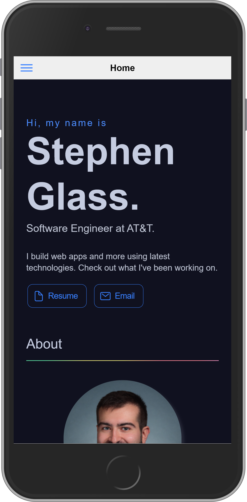
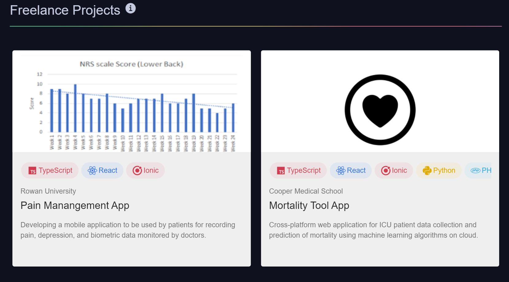

# React Software Portfolio

This project allows you to build a Software Engineer Portfolio by offering pre-made components with a simple template schema. Built using React and [Ionic Framework](https://ionicframework.com).

## Demo

[Live Demo](https://stephen.glass)



[Desktop](./docs/demo_desktop.png)

## Installation

[Download](https://nodejs.org/en/download/) Node.js

```
git clone https://github.com/sglass520/react-swe-portfolio.git
```

```
npm install -g @ionic/cli
npm install
ionic serve
```

## Configuration

### Page Contents

#### Structure

- `data/AppData.ts` Template for page contents and components.
- `data/AppMeta.ts` Metadata for additional options or images.
- `data/Links.ts` Defines links displayed in menu side bar and footer.
- `data/RedirectRoutes.ts` Defines additional external global routes (i.e linkedin, github).

#### AppData.ts

Components are added to the page template by modifying the `appSections` object which defines the list of components. The `AppSections` type has the following available properties.

| Property | Type         | Description                                                           |
| -------- | ------------ | --------------------------------------------------------------------- |
| url      | string       | The user will be redirected to this section if navigates to this URL  |
| iosIcon  | string       | Icon to show in menu sidebar for users on iOS devices                 |
| mdIcon   | string       | Icon to show in menu sidebar for users using Material theme           |
| title    | string       | Title of the section to show in section header                        |
| divider  | boolean      | (optional) Shows the section divider. Default is true.                |
| info     | string       | (optional) Shows an info icon with additional text. Default is false. |
| render   | ReactElement | The component to display in the section                               |

Example:

```
export const appSections: AppSection[] = [
  {
    title: "Home",
    url: "/home",
    iosIcon: homeOutline,
    mdIcon: homeSharp,
    render: () =>
      React.createElement(IntroductionArea, {
          ...
      }),
  },
  {
    title: "Foo",
    url: "/foo",
    iosIcon: personOutline,
    mdIcon: personSharp,
    render: () =>
      React.createElement(AboutArea, {
          ...
      }),
  }
];
```

A list of available components can be seen in the Components section of this document.

### Styling

Theme colors, breakpoints, page effect toggles are all configurable from `theme/globals.scss`. Theme colors specific to Ionic Framework components are configurable from `theme/variables.css`.

### Components

#### IntroductionArea

A component to introduce yourself.


Component properties:

| Property    | Type                       | Description                            |
| ----------- | -------------------------- | -------------------------------------- |
| topTitle    | string                     | (optional) Title to show above name    |
| name        | string                     | Your name to show                      |
| subtitle    | string                     | Subtitle to show below name            |
| description | string                     | Additional text to show under subtitle |
| buttons     | List\[IntroductionButton\] | Buttons to show in section             |

IntroductionButton properties:
| Property | Type | Description |
|----------|--------|----------------------------------------------|
| text | string | Text of the button |
| iosIcon | string | Icon to show in button for iOS platform |
| color | string | Icon to show in button for Material platform |
| link | string | Button link |

#### AboutArea

A component to give more info about yourself with text, pictures, and your skills.


Component properties:
| Property | Type | Description |
| -------------- | -------------------- | ----------------------------------------- |
| reverse | string | (optional) Reverses columns the component |
| text | string | Text to display in component |
| img | string | Path of image to display |
| skills | List[AboutSkills] | Skills to display |
| favoriteSkills | List[FavoriteSkills] | (optional) Display favorite skills |

AboutSkills properties:
| Property | Type | Description |
| -------- | ------ | ----------------------------- |
| text | string | The text of skill |
| color | string | Color of the skill object |
| icon | string | (optional) Icon for the skill |

FavoriteSkills properties:
| Property | Type | Description |
| -------- | ------ | ---------------------------- |
| text | string | The text of skill |
| img | string | Image to represent the skill |

#### FeaturedProjectsArea

A component to highlight your most important projects.



Component properties:
| Property | Type | Description |
| -------- | ---------------------------- | ---------------------------------------------------------------------- |
| columns | number | Number of columns of projects to display before overflowing to new row |
| projects | List[FeaturedProjectsObject] | Projects to display |

FeaturedProjectsObject properties:
| Property | Type | Description |
| ----------- | ------------------------- | -------------------------------------------- |
| img | string | (optional) Path of image to show for project |
| title | string | Title of the project |
| subtitle | string | Subtitle to display for project |
| description | string | Description of the project |
| link | string | (optional) Link for project |
| tags | List[FeaturedProjectTags] | (optional) Tags for project |

FeaturedProjectTags properties:
| Property | Type | Description |
| -------- | ------ | --------------------------- |
| name | string | Name of the tag |
| color | string | Color of the tag |
| icon | string | (optional) Icon for the tag |

#### ProjectsArea

A component to showcase all of your projects.


| Property | Type                 | Description                                          |
| -------- | -------------------- | ---------------------------------------------------- |
| layout   | List[DynamicLayout]  | Object to define responsive table layout of projects |
| projects | List[ProjectsObject] | Projects to display in component                     |

DynamicLayout properties:
| Property | Type | Description |
| -------- | ------ | ------------------------------------------------------------------------------------------------------------------ |
| minWidth | number | (optional) Minimum width (px) for the specified columns to be displayed. If no specified, then it becomes default. |
| columns | number | Number of columns to display for associated width (px) |

ProjectsObject properties:
| Property | Type | Description |
| ----------- | ------------------ | ----------------------------------------------------------------- |
| img | string | (optional) Path of image to display for project |
| imgType | "img" \| "icon | (optional) Specifies if image is an icon or image. |
| title | string | Title of the project |
| links | List[ProjectLinks] | (optional) Links for project |
| description | string | Description of the project |
| link | string | (optional) If clicking on project redirects you to specified link |
| tags | List[ProjectTags] | (optional) Specify tags for project |
| ribbon | ProjectRibbon | (optional) Specify a ribbon banner for project |

ProjectLinks properties:
| Property | Type | Description |
| -------- | ------ | ----------------------------------------- |
| iosIcon | string | Icon to show for iOS platforms |
| mdIcon | string | Icon to show for Material theme platforms |
| link | string | Link url |

ProjectTags properties:
| Property | Type | Description |
| -------- | ------ | ------------------------------------------------ |
| name | string | Name of the tag |
| color | string | (optional) Color of the tag. Default is primary. |
| icin | string | (optional) Icon for the tag |

ProjectRibbon properties:
| Property | Type | Description |
| ----------- | ---------------- | -------------------------------------------------------- |
| background | string | Background color of the ribbon |
| color | string | Text color in the ribbon |
| contentType | "text" \| "icon" | Specify if ribbon is going to contain text or be an icon |
| content | string | Content for ribbon. Either text or an icon. |

#### TimelineArea

A component to render a timeline which can be used to show your work history.


Component properties:
| Property | Type | Description |
| --------- | -------------------- | -------------------------------------------------------------------------------------------------------------------------------- |
| alternate | boolean | (optional) If true, timeline cards will alternate sides. Otherwise, all cards will be on same side of timeline. Default is true. |
| side | "left" \| "right" | (optional) If alternate is true, this sets the starting side. If alternate is false, this sets the side of card contents. |
| items | List[TimelineObject] | Timeline content cards |

TimelineObject properties:

| Property    | Type   | Description                                  |
| ----------- | ------ | -------------------------------------------- |
| subtitle    | string | Subtitle of timeline item                    |
| title       | string | Title of timeline item                       |
| undertitle  | string | Additional text under the title              |
| description | string | (optional) Description for the timeline item |

#### ContactArea

A component to show your contact information.

Component properties:

| Property | Type                | Description                                |
| -------- | ------------------- | ------------------------------------------ |
| text     | string              | Text to display in component               |
| buttons  | List[ContactButton] | (optional) Buttons to display in component |

ContactButton properties:

| Property | Type   | Description                                  |
| -------- | ------ | -------------------------------------------- |
| text     | string | Text of the button                           |
| iosIcon  | string | Icon to show in button for iOS platform      |
| color    | string | Icon to show in button for Material platform |
| link     | string | Button link                                  |
